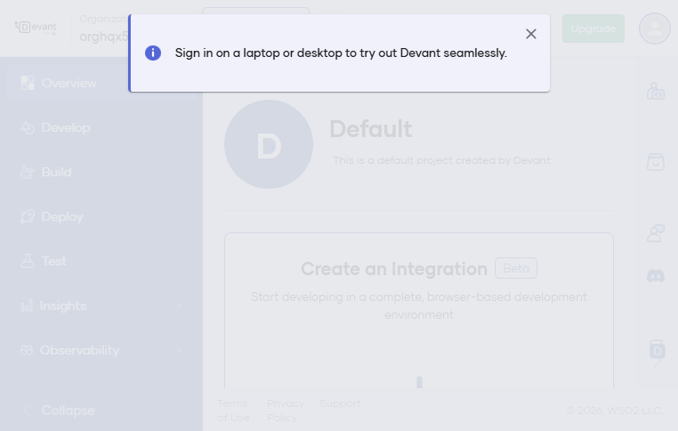
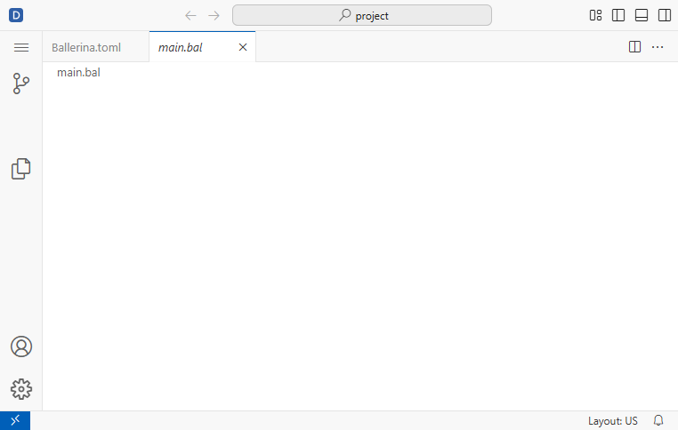
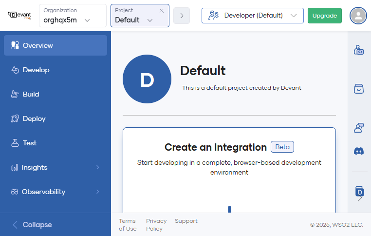

# How to Create an HTTP GET Request in Ballerina Integrator - Workflow Guide

**Version:** 2.0  
**Created:** 2026-02-10  
**Last Modified:** 2026-02-10  
**Platform:** Devant WSO2 Integrator (Low-Code)  
**Status:** Refined

## Overview

This document guides creation of a simple HTTP GET endpoint in Devant using low-code only. The endpoint returns a JSON message: "hello from Ballerina integrator".

## Strict Low-Code Rules

- Use only low-code UI elements (Entry Points, Listeners, Connections, etc.).
- Do NOT open or edit any .bal files.
- Do NOT use Show Source or any code view.
- Do NOT modify code directly in the editor.
- If a step requires code, stop and request guidance.

## Waiting and Loading Rules

- After each UI action, wait 2-5 seconds for resources to load.
- If a spinner or loading indicator is visible, wait until it disappears.
- If the UI looks blank or partially loaded, wait and retry after 3 seconds.
- Capture a screenshot only after the UI is fully loaded and stable.

## Step-by-Step Workflow

### Stage 1: Accessing Devant Platform

#### Step 1.1: Navigate to Devant Console
- URL: https://devant.dev
- Expected Result: Redirects to console.devant.dev with organization dashboard
- Wait: 3 seconds after redirect completes

#### Step 1.2: Login (if required)
- Email: vishwajayawickrama2002@gmail.com
- Password: vishwacat
- If OTP is required, ask the user
- Wait: 3-5 seconds after sign-in completes

#### Step 1.3: Project Dashboard
- Open the "Default" project
- Wait: 2-3 seconds for widgets to load

Screenshot:


### Stage 2: Accessing the Integration Editor

#### Step 2.1: Create New Integration
- Click "Create an Integration" (Beta)
- Wait: 5 seconds for the editor to open in a new tab

Screenshot:


#### Step 2.2: Editor Interface Loads
- Confirm the editor is visible and stable
- Wait: 3-5 seconds for extensions to finish loading

Screenshot:


### Stage 3: HTTP GET Creation (Low-Code Only)

#### Step 3.1: Open Entry Points
- In the left panel, click "Entry Points"
- Wait: 2-3 seconds for the toolbar to appear

#### Step 3.2: Add HTTP GET Entry Point
- Click "Add Entry Point"
- Wait: 3-5 seconds for the low-code dialog to load
- Configure:
  - Entry Point Type: HTTP Resource
  - Method: GET
  - Path: /hello
  - Name: HelloWorldGET

Screenshot:


#### Step 3.3: Configure Response Mapping
- Set Content-Type: application/json
- Response Body:
  - message: "hello from Ballerina integrator"
- Wait: 2 seconds after applying mappings

Screenshot:


### Stage 4: HTTP Listener Configuration

#### Step 4.1: Configure HTTP Listener
- Click "Listeners"
- Add HTTP listener:
  - Port: 8080
  - Host: localhost
- Wait: 2-3 seconds after saving

### Stage 5: Deployment and Testing

#### Step 5.1: Deploy Integration
- Click "Run Integration"
- Wait until deployment completes (5-10 seconds)

#### Step 5.2: Test the Endpoint
- URL: http://localhost:8080/hello
- Expected Response:
```
{
  "message": "hello from Ballerina integrator"
}
```

## Screenshots

- Devant Dashboard: ../screenshots/v2_step_01_devant_dashboard.png
- Dashboard Banner Closed: ../screenshots/v2_step_02_dashboard_banner_closed.png
- Editor Loading: ../screenshots/v2_step_03_editor_loading.png
- Entry Points Selected: ../screenshots/v2_step_04_entry_points_selected.png
- Add Entry Point Attempt: ../screenshots/v2_step_05_add_entry_point_attempt.png
- Editor Refreshed: ../screenshots/v2_step_06_editor_refreshed.png
- Editor Reopened: ../screenshots/v2_step_07_editor_reopened.png

## Expected Output

HTTP Response (200 OK):
```
{
  "message": "hello from Ballerina integrator"
}
```

## Testing Instructions

Using cURL:
```bash
curl -X GET http://localhost:8080/hello \
  -H "Content-Type: application/json"
```

## Notes

- This guide enforces strict low-code usage.
- Do not open or use any code views.
- If any step requires code editing, stop and request guidance.

## Troubleshooting

### Low-code panel does not load

Symptoms:
- "There is no data provider registered that can provide view data."
- Add Entry Point dialog does not appear after clicking the button.
- CDN requests fail or are refused.

Actions Taken:
1. Refreshed the editor tab and waited for extensions to load.
2. Closed the editor tab and reopened the integration from the dashboard.

Current Status:
- Low-code panel still unavailable after reload and reopen.
- Further progress requires the low-code view to load.

