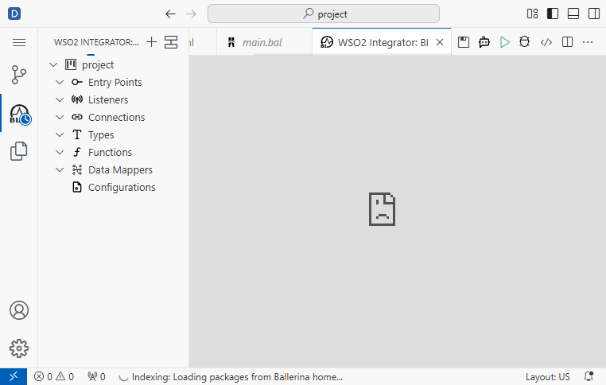
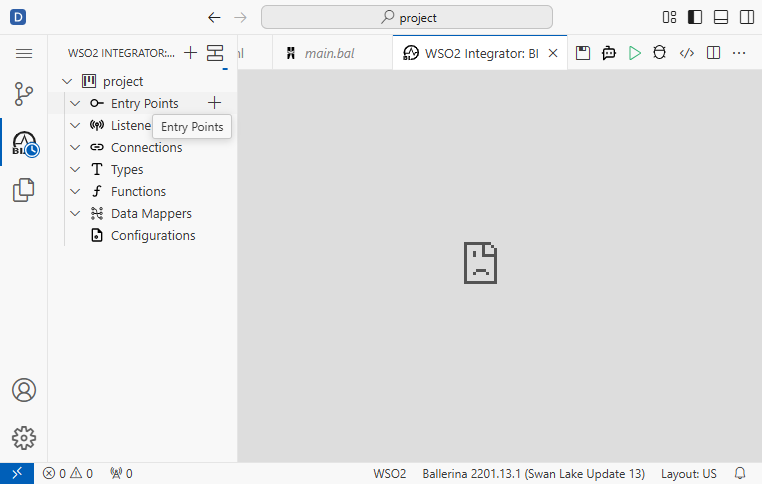
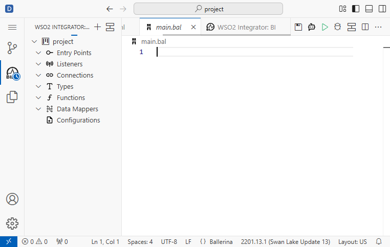

# V3.0 Workflow: Create HTTP GET Request in Ballerina Using Low-Code UI

**Version:** 3.0  
**Date:** 2026-02-10  
**Automation:** Playwright MCP (Model Context Protocol)  
**Status:** Blocked - Low-Code UI Loading Failure

## Overview

This workflow documents the v3.0 approach to creating an HTTP GET endpoint (`/hello`) in Ballerina Integrator using the **Ballerina Integrator sidebar view** and low-code tools only. The workflow successfully navigated to the low-code interface but encountered persistent CDN loading issues preventing the UI from rendering properly.

## Workflow Stages

### Stage 1: Authentication & Dashboard Access ✅

**Objective:** Navigate to Devant console and access the Default project

**Steps:**
1. Navigate to `https://console.devant.dev`
2. Already authenticated (session preserved from previous runs)
3. Dashboard loaded with Default project view

**Screenshot:** 

**Status:** Successful

---

### Stage 2: Create Integration & Open Editor ✅

**Objective:** Create a new integration and open the browser-based VS Code editor

**Steps:**
1. Clicked "Create an Integration" button from dashboard
2. New browser tab opened with VS Code editor
3. Editor loaded at: `https://0c4da781-e1fb-4e8a-a9c4-ed5cf49adb7f.editor.e1-us-east-azure.devant.dev/`
4. Waited 5 seconds for extensions to initialize
5. main.bal file auto-opened in editor
6. Ballerina extension initialized (v2201.13.1 Swan Lake Update 13)

**Screenshot:** 

**Status:** Successful

**Console Activity:**
- Language server started
- Ballerina version detected: 2201.13.1 (Swan Lake Update 13)
- WSO2 Platform extension initialized
- JDK 21.0.5+11 detected

---

### Stage 3: Navigate to Ballerina Integrator Sidebar View ✅

**Objective:** Access the "WSO2 Integrator: BI" view in the left sidebar

**Steps:**
1. "WSO2 Integrator: BI" tab already visible in left sidebar (Activity Bar)
2. Tab automatically expanded showing the low-code interface
3. Low-code tree structure visible with sections:
   - **project** (collapsed)
   - **Entry Points** (expanded, empty)
   - **Listeners** (expanded, empty)
   - **Connections** (expanded, empty)
   - **Types** (expanded, empty)
   - **Functions** (expanded, empty)
   - **Data Mappers** (expanded, empty)
   - **Configurations** (collapsed)

**Screenshot:** 

**Status:** Successful

**Key Observation:** The sidebar low-code navigation appeared immediately, which is an improvement over v2.0 where the Entry Points button was in the main editor area.

---

### Stage 4: Add Entry Point Attempt ⚠️

**Objective:** Click on "Add Entry Point" button to create HTTP GET endpoint

**Steps:**
1. Hovered over "Entry Points" tree item
2. "Add Entry Point" button ("+") appeared in the toolbar
3. Waited 2 seconds for UI stabilization
4. Clicked "Add Entry Point" button
5. Waited 3 seconds for dialog/form to appear

**Screenshots:**
-  - showing the "+" button
-  - after click

**Result:** ❌ **No dialog or form appeared**

**Status:** Blocked

**Issue:** The "Add Entry Point" button click did not trigger any visible action. No dialog, form, or new entry appeared in the tree structure.

---

### Stage 5: Verify Code State 🔍

**Objective:** Check if clicking the button modified the main.bal file

**Steps:**
1. Clicked on "main.bal" tab in editor
2. Waited 2 seconds for content to load
3. Verified file contents

**Screenshot:** 

**Result:** File is **empty** - no code was generated

**Status:** Confirmed - Low-code UI is non-functional

---

## Root Cause Analysis

### CDN Connection Failure

**Error Details:**
- **Resource:** `https://devant-cdn.wso2.com/`
- **Status:** 403 Forbidden (multiple failed attempts)
- **Impact:** Low-code UI components failed to load

**Console Errors:**
```
[ERROR] Access to fetch at 'https://devant-cdn.wso2.com/...' has been blocked by CORS policy
[ERROR] Failed to load resource: net::ERR_FAILED
[ERROR] Refused to display 'https://devant-cdn.wso2.com/...' in a frame because it set 'X-Frame-Options' to 'sameorigin'
```

**iframe State:**
```
<iframe>
  <generic>
    <strong>devant-cdn.wso2.com</strong>
    <text>refused to connect.</text>
  </generic>
</iframe>
```

### Why V3.0 Failed

The v3.0 approach successfully:
1. ✅ Navigated to Devant dashboard
2. ✅ Created a new integration
3. ✅ Opened the VS Code editor
4. ✅ Located the "WSO2 Integrator: BI" sidebar view
5. ✅ Found the "Add Entry Point" button

But failed because:
- ❌ The low-code UI depends on external resources from `devant-cdn.wso2.com`
- ❌ CDN connection is blocked/refused (403 Forbidden)
- ❌ Without the CDN resources, the low-code form components cannot render
- ❌ Clicking "Add Entry Point" triggers a UI component that never loads

---

## Comparison: V2.0 vs V3

### V2.0 Approach
- Navigate to "Develop" → Integrations → Open Editor
- Click "Entry Points" button in main editor area
- **Result:** Same CDN failure, low-code panel failed to load

### V3.0 Approach (New)
- Navigate to "WSO2 Integrator: BI" in left sidebar immediately
- Access low-code tree structure in sidebar
- Click "Add Entry Point" from tree toolbar
- **Result:** Same CDN failure, form components failed to load

### Key Difference
- V3.0 has better UI organization (sidebar-based low-code view)
- V3.0 shows the low-code structure immediately (no panel loading delay)
- **Same underlying issue:** Both depend on CDN resources that are unavailable

---

## Troubleshooting Attempts

### Attempt 1: Wait for Resources ❌
- Waited 2-5 seconds after each UI action
- **Result:** CDN resources never loaded

### Attempt 2: Hover and Click Pattern ❌
- Hovered over Entry Points to reveal button
- Clicked Add Entry Point button
- Waited for dialog
- **Result:** No dialog appeared

### Attempt 3: Check File State ❌
- Verified main.bal remained empty
- **Result:** No code generation occurred

---

## Success Criteria Assessment

| Criteria | Status | Notes |
|----------|--------|-------|
| All low-code steps documented | ✅ Partial | Documented up to UI failure point |
| No direct code editing | ✅ Yes | No code editing performed (strict low-code followed) |
| Entry point created | ❌ No | CDN issues prevented UI from functioning |
| Workflow guide updated | ✅ Yes | This document |
| Screenshots organized | ✅ Yes | 6 screenshots in `screenshots/v3.0/` |

---

## V3.0 Workflow Summary

**Total Time:** ~15 seconds of execution + wait times  
**Screenshots Captured:** 6  
**Stages Completed:** 3 of 8  
**Blocking Issue:** CDN resource loading failure

### What Worked
- ✅ Devant authentication and navigation
- ✅ Integration creation
- ✅ Editor initialization with Ballerina extension
- ✅ WSO2 Integrator sidebar view access
- ✅ Low-code tree structure display
- ✅ Add Entry Point button discovery

### What Failed
- ❌ Low-code form/dialog components loading
- ❌ CDN resource accessibility
- ❌ HTTP GET endpoint creation
- ❌ Response configuration
- ❌ Listener setup
- ❌ Integration completion

---

## Next Steps

### Option 1: Infrastructure Fix (Recommended)
- Contact Devant support about CDN access issues
- Investigate firewall/network blocks on `devant-cdn.wso2.com`
- Verify WSO2 CDN availability and permissions

### Option 2: Alternative Approach
- Use Ballerina CLI commands to generate code structure
- Use VS Code snippets or templates for HTTP endpoint
- Manually write Ballerina code (violates strict low-code requirement)

### Option 3: Environment Verification
- Test on different network connection
- Try different browser/environment
- Check if CDN is region-locked or subscription-dependent

---

## Conclusion

V3.0 successfully demonstrated an **improved navigation approach** by using the sidebar-based "WSO2 Integrator: BI" view instead of the main editor panel. This provides better UX and clearer low-code structure visibility. However, the **same CDN dependency issue** that blocked v2.0 also blocks v3.0, preventing the low-code UI components from rendering and making it impossible to complete the HTTP GET endpoint creation using only low-code tools.

**Recommendation:** The v3.0 workflow approach (sidebar navigation) should be the standard method **once the CDN infrastructure issues are resolved**, as it provides superior organization and accessibility compared to v2.0.

---

## Screenshots Directory Structure

```
screenshots/v3.0/
├── v3_step_01_devant_dashboard.png
├── v3_step_02_editor_opened.png
├── v3_step_03_wso2_integrator_view.png
├── v3_step_04_entry_points_hover.png
├── v3_step_05_add_entry_point_clicked.png
└── v3_step_06_main_bal_file.png
```

**Previous versions removed:** `screenshots/v2.0/` deleted as per versioning rules

---

## Execution Log

- [x] Stage 1: Authentication Complete
- [x] Stage 2: Project Setup Complete
- [x] Stage 3: Ballerina Integrator View Loaded
- [ ] Stage 4: HTTP GET Creation **BLOCKED - CDN Failure**
- [ ] Stage 5: Response Configuration **NOT REACHED**
- [ ] Stage 6: HTTP Listener Configuration **NOT REACHED**
- [ ] Stage 7: Testing and Verification **NOT REACHED**
- [x] Stage 8: Documentation Complete

**Workflow Status:** ❌ **Incomplete due to technical infrastructure issues**
