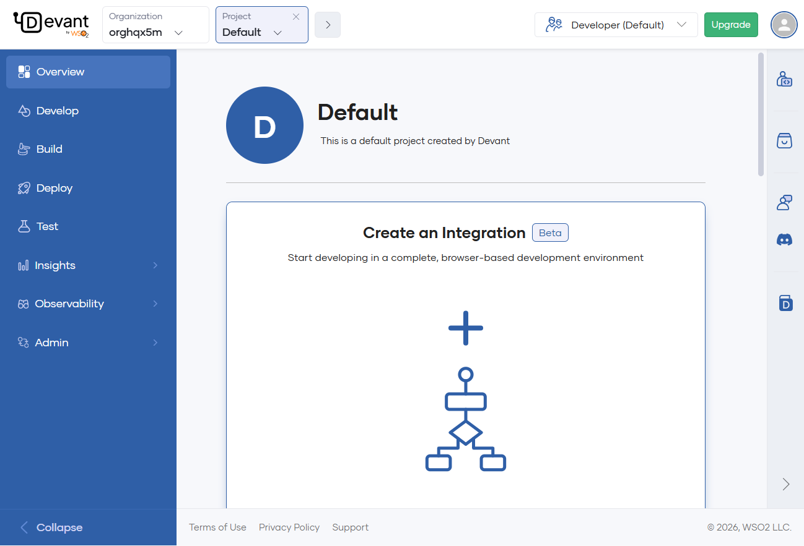
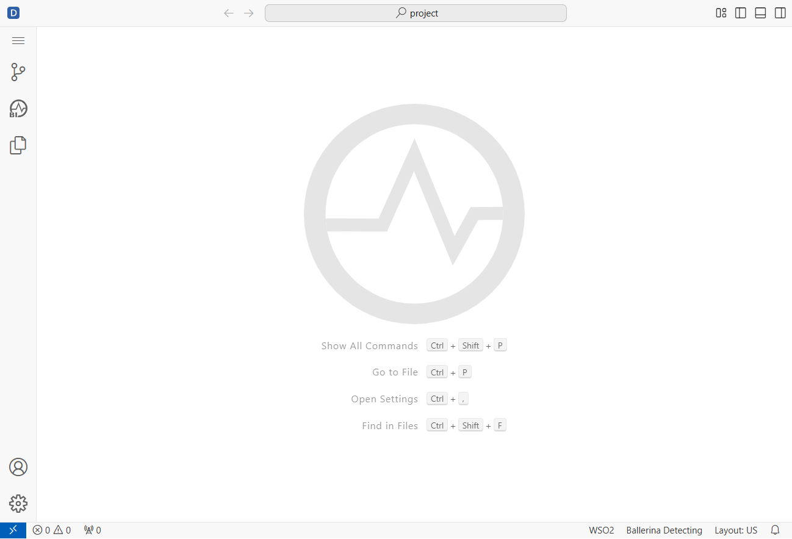
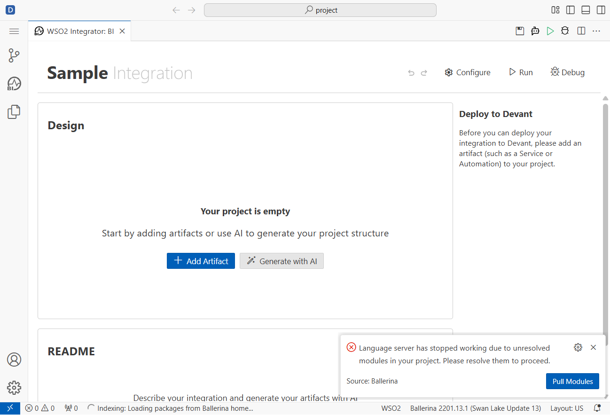
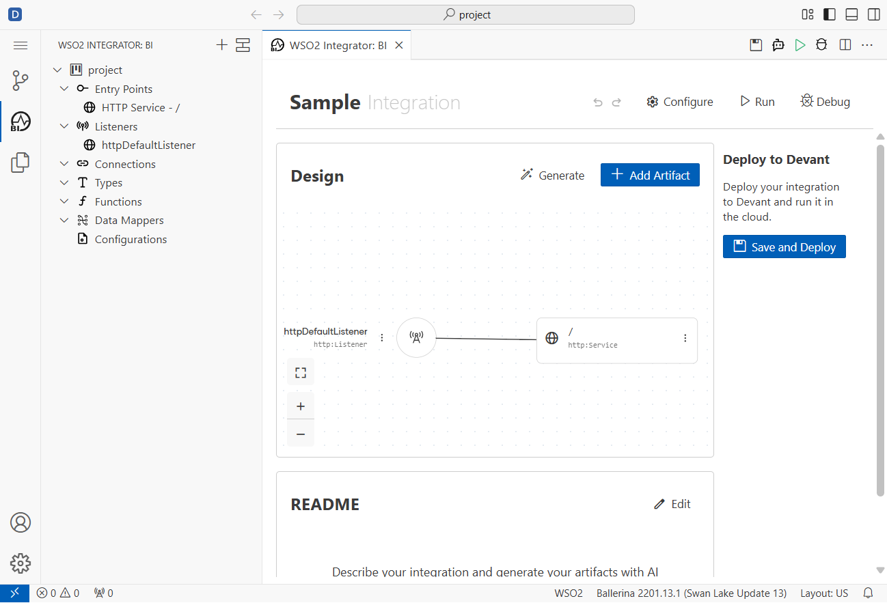

# Ballerina HTTP GET Request Creation Workflow - v5.0

**Version:** 5.0  
**Date:** February 10, 2026  
**Status:** Finalized – Pending listener port confirmation and Try It run (port 8080 busy)

---

## Step-by-Step Guide (with screenshots)

1) Open the project dashboard
- In the Devant portal, select the Default project to reach the landing dashboard.
- 

2) Launch the cloud editor
- Click Create Integration to open the remote VS Code–based editor. Confirm the shell is fully loaded.
- 

3) Switch to Ballerina Integrator (BI)
- Select the WSO2 Integrator: BI tab. You should see an empty canvas ready for artifacts.
- 

4) Create an HTTP Service
- In the BI palette, add an HTTP Service. The default listener `httpDefaultListener` is wired to the base path `/`.
- 

5) Add a GET /hello resource
- Use Add Resource → GET and set the resource path to `hello`.
- Configure the response: status 200, JSON body `{ "message": "hello from Ballerina integrator" }`.
- Save the resource.
- 

6) Listener notes (port visibility)
- The listener form exposed the name only; host/port fields were not visible in the UI, so the listener remained at defaults. Port 8080 appears to be the default and was busy during run.

7) Try/Run observations
- Attempting Run Integration failed with `failed to start server connector '0.0.0.0:8080': Address already in use`. Because the service could not start, Try It was not executed.
- To proceed later: free port 8080 or change the listener port (if the UI exposes it), then rerun and use Try It for GET /hello to verify the JSON response.

8) Documentation status
- This guide is finalized; pending items are listener port confirmation and a successful Try It capture once the port conflict is resolved.

## Status Checklist

- [x] Stage 1: Authentication Complete
- [x] Stage 2: Project Setup Complete
- [x] Stage 3: Ballerina Integrator View Loaded
- [x] Stage 4: HTTP GET Creation Complete
- [x] Stage 5: Response Configuration Complete
- [ ] Stage 6: HTTP Listener Configuration Complete
- [ ] Stage 7: Testing and Verification Complete (blocked by port conflict)
- [x] Stage 8: Documentation Complete
